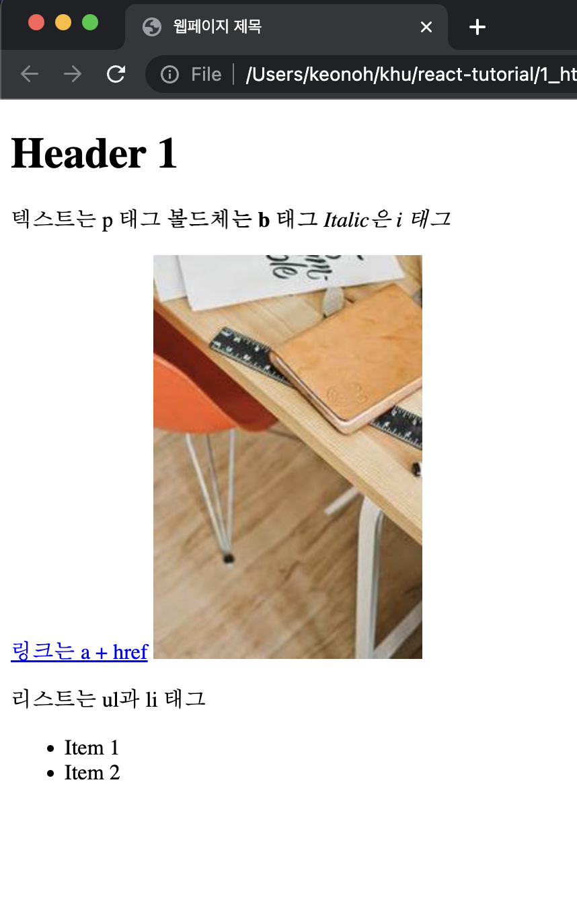
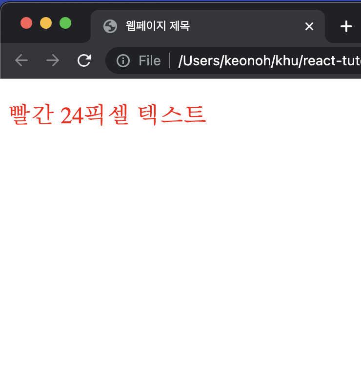
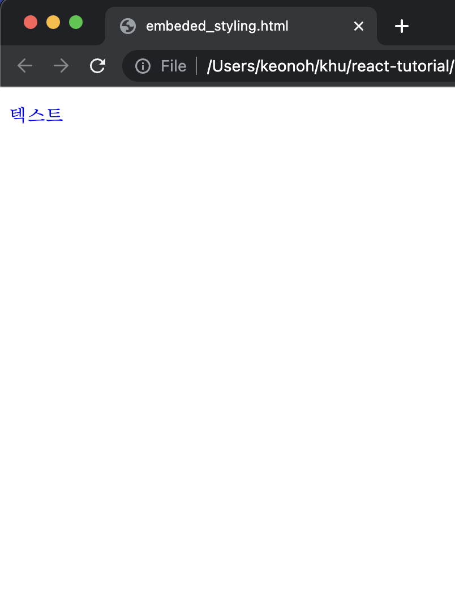
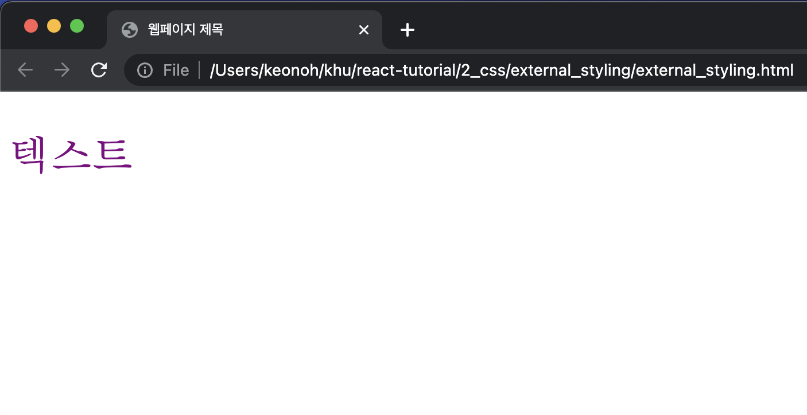
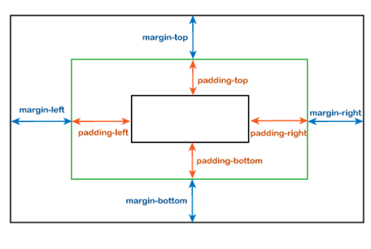

# UI/UX 프로그래밍 - React Tutorial

발표자: 김건오

<p style="bottom: 1rem; position: absolute;">강의 자료: http://github.com/keonoh00/react-tutorial</p>

---

## Outline (1)

<div class="columns">

<div>

### HTML

- HTML 이란?
- HTML 문서 구조, 태그와 요소

</div>

<div>

### CSS

- CSS 란?
- Inline, Internal, and External Stylesheets
- Selectors
- 자주 사용하는 스타일링
- Tips

</div>

</div>

<p style="bottom: 1rem; position: absolute;">강의 자료: http://github.com/keonoh00/react-tutorial</p>

---

## Outline (2)

<div class="columns">

<div>

### JavaScript

- JavaScript 개요
- 변수 및 연산자
- 조건문과 반복문
- 함수 (ES6 기반)

</div>

<div>

### React.js

- React 소개 & 프레임워크란?
- React 프로젝트 만들기
- State, Props, and Hooks
- Todo App 만들기

</div>

</div>

<p style="bottom: 1rem; position: absolute;">강의 자료: http://github.com/keonoh00/react-tutorial</p>

---

## HTML 이란?

- HTML - Hyper Text Markup Language
  - 웹사이트를 구성하는 Markup Language

- Markup Language
  - 문서의 구조요 내용을 구분하고 구성할 수 있게 해주는 언어

---

## HTML 문서구조, 구성요소, 태그

<div class="columns">

<div>



</div>

<div>

```html
<!DOCTYPE html> <!-- 선언문 -->
<html> <!-- HTML 시작 -->
  <head> <!-- 머리글 시작 -->
    <title>웹페이지 제목</title>
  </head> <!-- 머리글 끝 -->
  <body> <!-- 본문 -->
    <div id="root">
      <h1>Header 1</h1>
      <p>
        텍스트는 p 태그
        <b>볼드체는 b 태그</b>
        <i>Italic은 i 태그</i>
      </p>
      <a href="https://www.google.com">링크는 a + href</a>
      
      <p>리스트는 ul과 li 태그</p>
      <ul>
        <li>Item 1</li>
        <li>Item 2</li>
      </ul>
    </div>
  </body> <!-- 본문 끝 -->
</html>
```

</div>

</div>

---

## CSS 란?

- 웹페이지의 디자인과 레이아웃을 지정하는 StyleSheet 언어
  - [파일이름].css 확장자명을 갖는다.
- CSS의 중요성
  - 시각적인 디자인
  - 일관성 유지
  - 유지보수의 용이성
  - 반응형 디자인
- 3가지 CSS 적용방법: Inline, Embedded, External

---

## Inline Styling

<div class="columns">

<div>

```html
<!DOCTYPE html>
<html>
  <head>
    <title>웹페이지 제목</title>
  </head>
  <body>
    <p style="color: red; font-size: 24px;">
      빨간 24픽셀 텍스트
    </p>
  </body>
</html>
```

</div>

<div>



</div>

</div>

---

## Embedded Styling

<div class="columns">

<div>

```html
<!DOCTYPE html>
<html>
  <head>
    <!-- Embedded Styling 예시 -->
    <style>
      p {
        /* 모든 <p> 태그를 파란색으로 변경 */
        color: blue;
      }
    </style>
    <!-- Embedded Styling 예시 끝 -->
  </head>
  <body>
    <p>텍스트</p>
  </body>
</html>
```

</div>

<div>



</div>

</div>

---

## External Styling

<div class="columns">

<div>

<h4>external_styling.html</h4>

```html
<!DOCTYPE html>
<html>
  <head>
    <link rel="stylesheet" href="./external_styling.css">
    <title>웹페이지 제목</title>
  </head>
  <body>
    <p>텍스트</p>
  </body>
</html>
```

</div>

<div>

<h4>external_styling.css</h4>

```css
/* 모든 p 태그의 */
p {
  /* 폰트 크기는 36px */
  font-size: 36px;
  /* 보라색으로 변경  */
  color: purple;
}
```

</div>

</div>

---

## External Styling

<center>



</center>

---

## CSS Selector

- 모든 텍스트가 같은 색, 같은 크기, 같은 위치에 있으면 재미없는 웹사이트
- HTML Attribute를 이용하여 구분
  - 각각의 태그에 이름을 붙여주는 법
  - `class`, `id`, `type` 를 사용할 수 있다.
- HTML에 attribute를 우선 선언하고 CSS에서 스타일을 설정

---

## `class`, `id`, `type` Selector 사용법

<div class="columns">

<div>

### HTML

```html
<div class="this-is-class">
  <p id="this-is-id">Random</p>
  <p type="this-is-type">Hello</p>
</div>
```

</div>

<div>

### CSS

```css
.this-is-class {
  background-color: blue;
}

#this-is-id {
  color: red;
}

[type="this-is-type"] {
  color: green;
}
```

</div>

</div>

---

## 자주 사용하는 스타일링

<div class="columns">

<div>

- 크기는 `width`와 `height`
- 여백은 `padding` 혹은 `margin`
- 정렬은 `justify-content`와 `align-content`
- 색상관련은 `color`, `font-color`, `background-color`
- 가로정렬을 원할때는 `flex-direction: row`, 기본값은 `column`

</div>

<div>



</div>
</div>

---

## Tips

- UI 구현에서 가장 중요한 것은 네모를 그리는 것
  - 큰 네모부터 작은 네모까지
- `flex`를 이용하여 레이아웃을 구성하는 것이 편리
- 이것 저것 시도해보면서 익숙해지는 것이 중요
- [CSS Reference](https://developer.mozilla.org/en-US/docs/Web/CSS/Reference) 에서 다양한 CSS 속성 확인 가능

---

## JavaScript 개요

<div class="columns">

<div>

- JavaScript는 웹 브라우저에서 실행되는 언어로 웹페이지를 동적으로 만들기 위해 사용하는 언어
- 페이지 이동, 프레임 관리, 히스토리 관리 등 다양한 기능 수행
- 일반적으로 `css`처럼 `html` 파일 내부에 작성 혹은 `js` 파일로 작성 후 링크

</div>

<div>

- `<head>` 태그 내부에 작성
  - 웹브라우저가 HTML을 `<head>`부터 읽기 때문에 `<body>` 태그보다 먼저 실행

```html
<head>
  <!-- 내부 작성법 -->
  <script>
    // JavaScript 코드 작성
  </script>
  <script src="./index.js"></script> <!-- js 파일 링크 -->
</head>
```

</div>

</div>

---

## 변수 선언 및 연산자

<div class="columns">

<div>

```javascript
let a = 1; // 변수
const b = 2; // 상수
var c = 3; // ES6 이전에 사용하던 변수 선언 방식
```

</div>

<div style="margin-bottom:10px">

```javascript
a + b; // 3
a - b; // -1
a * b; // 2
a / b; // 0.5
a % b; // 1
a ** b; // 1
a++; // 2
a--; // 1
a += b; // 3
a -= b; // 1
a *= b; // 2
a /= b; // 1
a %= b; // 1
a **= b; // 1
```

</div>

</div>

---

## 조건문과 반복문

<div class="columns">

<div>

```javascript
if (a > b) {
  console.log("a가 b보다 큽니다.");
} else if (a < b) {
  console.log("a가 b보다 작습니다.");
} else {
  console.log("a와 b가 같습니다.");
}
```

</div>

<div>

```javascript
for (let i = 0; i < 10; i++) {
  console.log(i);
}

while (a < b) {
  console.log("a가 b보다 작습니다.");
  a++;
}
```

</div>

</div>

---

## 함수

```javascript
function add(a, b) {
  return a + b;
}

// es6 이후
const add = (a, b) => {
  return a + b;
};

const add = (a, b) => a + b;
```

---

## React 소개

<div class="columns">

<div>

- React는 Facebook에서 만든 JavaScript 프레임워크
- 프레임워크란?
  - 프로그램의 특정 문제를 해결하기 위해 상호 협력하는 클래스와 인터페이스의 집합
  - 프레임워크는 뼈대를 제공하여 개발자가 뼈대 위에 코드를 작성
  - 프레임워크는 개발자가 코드를 작성하는 방식을 제한

</div>

<div>

- React는 컴포넌트 기반으로 작동
- 컴포넌트란?
  - UI를 구성하는 작은 단위
  - 재사용이 가능한 API
- React는 컴포넌트를 이용하여 UI를 구성

<svg style="margin-left: 250px" width="20%" height="20%" viewBox="-10.5 -9.45 21 18.9" fill="none" xmlns="http://www.w3.org/2000/svg" class="mt-4 mb-3 text-link dark:text-link-dark w-24 lg:w-28 self-center text-sm mr-0 flex origin-center transition-all ease-in-out"><circle cx="0" cy="0" r="2" fill="currentColor"></circle><g stroke="currentColor" stroke-width="1" fill="none"><ellipse rx="10" ry="4.5"></ellipse><ellipse rx="10" ry="4.5" transform="rotate(60)"></ellipse><ellipse rx="10" ry="4.5" transform="rotate(120)"></ellipse></g></svg>

</div>

</div>

---

## React 프로젝트 만들기

- React 프로젝트를 만들기 위해서는 `Node.js`가 설치되어 있어야 한다.
- `Node.js` 설치 후 `npm`을 이용하여 `create-react-app`을 설치

```bash
npx create-react-app <프로젝트 이름>
cd <프로젝트 이름>
npm start
```

---

## React 프로젝트 구조

<div class="columns">

<div>

```bash
├── README.md
├── node_modules
├── package.json
├── .gitignore
├── public
│   ├── favicon.ico
│   ├── index.html
│   └── manifest.json
└── src
    ├── App.css
    ├── App.js
    ├── App.test.js
    ├── index.css
    ├── index.js
    ├── logo.svg
    └── reportWebVitals.js              
```

</div>

<div>

- `node_modules` 폴더는 각종 의존성 모듈이 위치 (라이브러리들)
- `package.json` 파일은 프로젝트의 정보와 의존성 모듈 정보가 담겨있음
- `.gitignore` 파일은 git remote에 올리지 않을 파일들을 지정
- `src` 폴더가 메인 폴더
  - `index.js` 파일이 가장 기본 파일
  - `index.js` 가 리액트 파일인 `App.js`를 `import` 하여 사용

</div>

</div>

---

## State, Props, and Hooks

- React에서는 컴포넌트의 상태를 관리하기 위해 `state`를 사용
  - 렌더링을 trigger하는 변수
- `props`는 컴포넌트 외부에서 전달되는 데이터
  - 컴포넌트에 input이자 컴포넌트의 렌더링을 trigger하는 데이터
- `hooks`은 함수형 컴포넌트에서 `state`와 `props`를 사용할 수 있게 해주는 함수
  - 리액트형 함수

---

## Todo App 만들기

- Todo App은 간단한 Todo List를 만드는 프로젝트
- Requirements:
  - Todo List에 새로운 Todo를 추가할 수 있다.
  - Todo List에서 Todo를 삭제할 수 있다.
  - Todo List에서 Todo의 완료 여부를 토글할 수 있다.
  - 날짜와 시간이 표시된다.

---

<h1 style="text-align: center; margin-top: 20%">Q&A</h1>

<p style="text-align: center; margin-top: 15%; font-size: 24px">해당 PPT는 <i>Marp</i>를 이용하여 HTML 및 마크다운 언어로 작성되었습니다</p>

</center>
</div>

---

<center>

<h1 style="margin-top: 20%">감사합니다!<h1>

</center>
